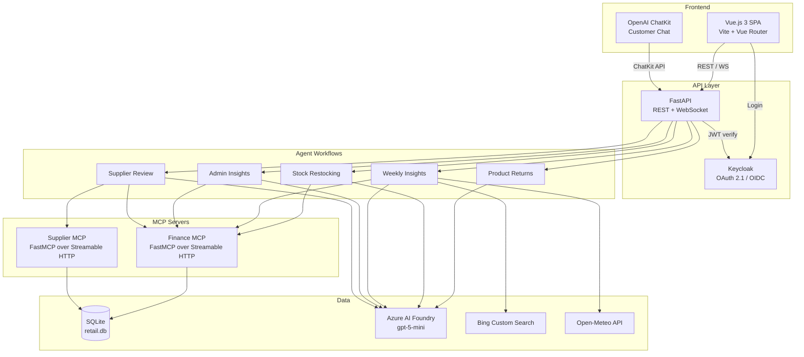
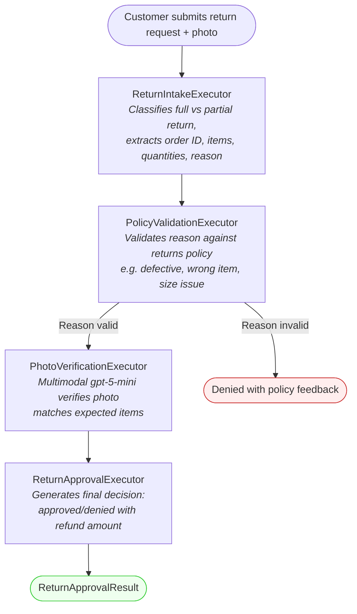
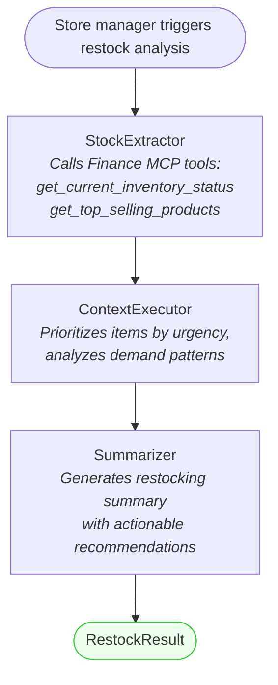
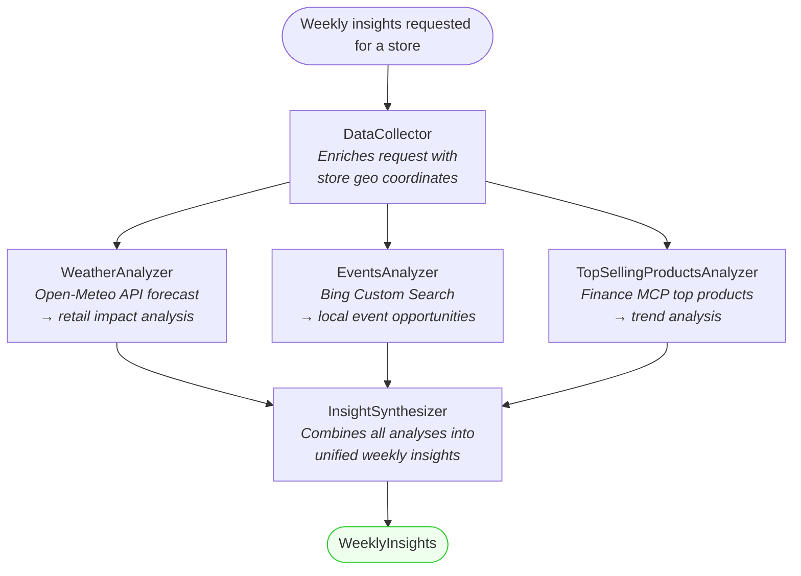
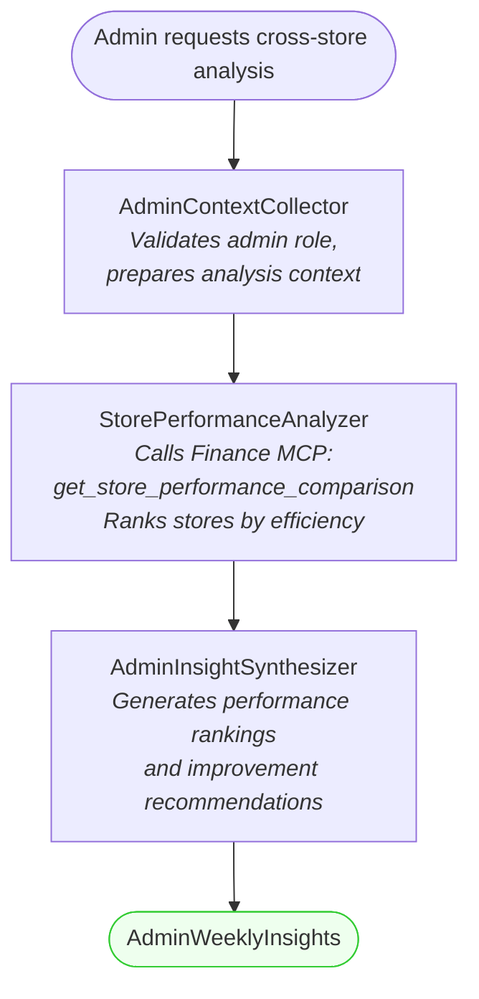
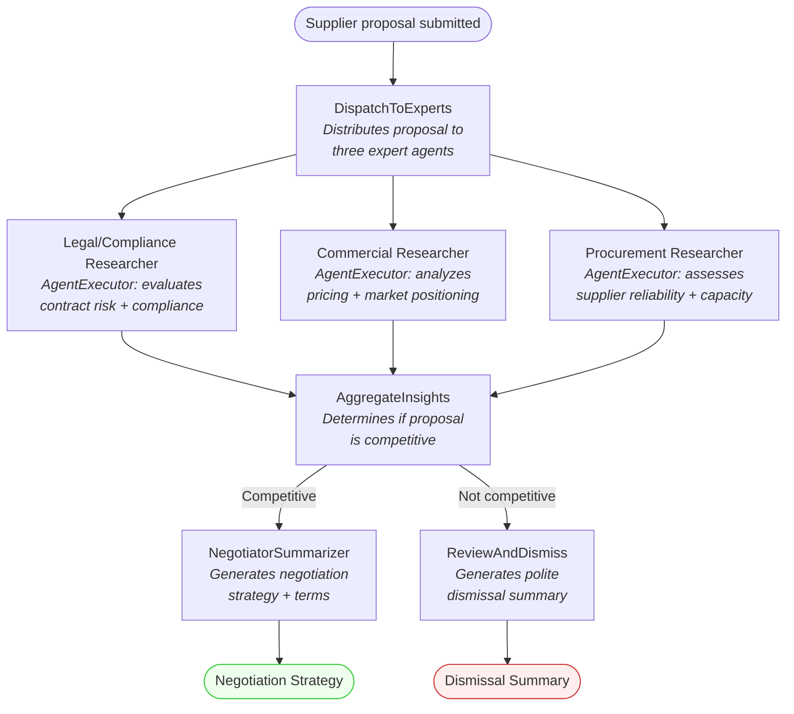

# Zava Pop-Up Shop

A full-stack AI-powered retail management application designed to showcase integration of AI agents into an existing business application. Built with **Microsoft Agent Framework**, **Azure AI Foundry**, **FastAPI**, **Vue.js 3**, and orchestrated by **.NET Aspire**.

## What is this?

Zava Pop-Up Shop is a fictional pop-up retail brand with 16 stores across the US (15 physical pop-ups + 1 online store). The application demonstrates how AI agents can be embedded into a real-world retail management system:

- **Customers** browse products, place orders, chat with an AI assistant, and submit product returns with AI-powered photo verification
- **Store managers** get AI-generated weekly insights (weather, events, top products), manage inventory with an AI restocking agent, and review supplier proposals through a multi-expert AI workflow
- **Admins** see cross-store performance comparisons generated by AI

The goal is to show practical patterns for integrating agents into existing apps — not just chat, but deterministic workflows, MCP tool servers, multimodal verification, and observability.

## Architecture



## Components

| Component | Path | Technology | Purpose |
|---|---|---|---|
| **Frontend** | `frontend/` | Vue 3, Vue Router 4, Vite 5, OpenAI ChatKit | Customer storefront, management dashboards, marketing views |
| **API** | `app/api/` | FastAPI, uvicorn, SQLAlchemy (async), FastAPI Cache | REST API + WebSocket endpoints for all frontend views |
| **Agents** | `app/agents/` | Microsoft Agent Framework 1.0.0rc3, Azure AI Foundry | 5 AI agent workflows (details below) |
| **Finance MCP** | `app/mcp/` | FastMCP 2.11+, Streamable HTTP, Keycloak auth | 8 finance/inventory data tools |
| **Supplier MCP** | `app/mcp/` | FastMCP 2.11+, Streamable HTTP, Keycloak auth | 5 supplier/procurement tools |
| **Shared** | `app/shared/` | SQLAlchemy ORM, Pydantic | Database models + config shared across services |
| **Data Generator** | `app/data/` | Faker, SQLAlchemy, JSON reference data | Generates SQLite `retail.db` with stores, products, customers, orders |
| **Auth** | `auth/` | Keycloak (Docker), custom theme | OAuth 2.1 identity provider with 3 roles |
| **Orchestration** | `apphost.cs` | .NET Aspire 13.3 | Local service orchestration, health checks, telemetry |
| **Infrastructure** | `infra/` | Azure Bicep | Azure Container Apps, AI Foundry, App Insights, ACR |

### Frontend

The Vue.js SPA has three main areas:

- **Customer views** — product browsing, category pages, store locations, order history, AI chat assistant, and product returns with photo upload
- **Management views** — dashboard with top categories, AI-generated weekly insights, inventory management with AI restocking agent, supplier management with AI proposal review, product catalog
- **Marketing views** — marketing dashboard with campaign analytics

Authentication is handled via Keycloak with three roles: `customer`, `store_manager`, and `admin`. Store managers see data filtered to their assigned store.

### MCP Servers

Both MCP servers use **FastMCP** with **Streamable HTTP** transport and **Keycloak OAuth 2.1** authentication. They expose tools that agents call to query the SQLite database through SQLAlchemy ORM.

**Finance MCP** (8 tools): `get_current_inventory_status`, `get_top_selling_products`, `get_historical_sales_data`, `get_company_order_policy`, `get_supplier_contract`, `get_stores`, `get_store_performance_comparison`, `get_current_utc_date`

**Supplier MCP** (5 tools): `find_suppliers_for_request`, `get_supplier_history_and_performance`, `get_supplier_contract`, `get_company_supplier_policy`, `get_current_utc_date`

### Observability

All Python services use **OpenTelemetry auto-instrumentation** with traces exported to **Azure Application Insights**. MCP calls propagate `traceparent` headers for distributed tracing across agent → MCP → database spans.

---

## Agentic Workflows

All workflows use **Microsoft Agent Framework** with **Azure AI Foundry** (model: `gpt-5-mini`). Each workflow is a directed graph of `Executor` nodes connected by edges.

### 1. Product Return Workflow

Processes customer product returns with policy validation and multimodal photo verification. Supports full-order and partial returns (customers can return a subset of units per item). All returns require a photo of the items being returned.



**Key features:**
- Embedded returns policy (defective, wrong item, size issue, changed mind, etc.)
- Multimodal photo verification using `gpt-5-mini` with `Content.from_data()` for image bytes
- Quantity-aware partial returns (e.g. ordered 2 backpacks, return only 1)
- Short-circuit denial when the reason violates policy (skips photo verification)
- Workflow state passing via `WorkflowContext.set_state()` / `get_state()`

### 2. Stock Restocking Workflow

Determines restocking strategies based on current inventory levels and sales data.



**Key features:**
- MCP tool integration with `tool_choice="required"` to force data retrieval
- WebSocket streaming to the frontend for real-time progress updates
- Finance MCP provides live inventory levels and sales performance data

### 3. Weekly Insights Workflow

Generates actionable retail insights for store managers by analyzing weather forecasts, local events, and product sales. Uses a fan-out/fan-in pattern for parallel data analysis.



**Key features:**
- Fan-out/fan-in pattern: three analyzers run in parallel, results converge at the synthesizer
- External API integration: Open-Meteo for weather, Bing Custom Search for local events
- File-based weekly cache per store to avoid redundant AI calls
- Each insight card has an action button for the store manager

### 4. Admin Weekly Insights Workflow

Enterprise-wide store performance comparison for admin users.



**Key features:**
- Role-gated: only users with `admin` role can trigger this workflow
- Compares all stores by revenue-per-customer efficiency metric
- Uses Finance MCP `get_store_performance_comparison` tool

### 5. Supplier Review Workflow

Reviews supplier proposals through multi-expert analysis. Three domain experts evaluate the proposal in parallel, results are aggregated, then routed to either negotiation or dismissal.



**Key features:**
- Fan-out/fan-in with conditional branching (`Case` / `Default` switch)
- Three `AgentExecutor` experts with MCP tool access (Finance MCP + Supplier MCP)
- Competitive proposals → negotiation strategy; non-competitive → polite dismissal
- Both MCP servers provide contract terms, supplier history, and performance data

---

## Authentication

> [!WARNING]
> This template comes with a Keycloak Docker image to mimic OAuth2 claims and login. The role of the Keycloak IdP is to show how to authenticate frontend through to the MCP.
> It has hardcoded usernames and passwords. Only use this for development.

### Copilot Studio OAuth 2.0 Configuration

The customer-facing chat widget can be powered by a [Copilot Studio](https://copilotstudio.microsoft.com) agent. To let the agent authenticate users against the deployed Keycloak instance, configure **Manual Authentication** (Generic OAuth2) in the Copilot Studio **Settings → Security → Authentication** page.

See the [Entra External ID + Copilot Studio tutorial](https://devblogs.microsoft.com/identity/integrate-copilot-studio-with-external-id/) for the general pattern — the table below adapts it for Keycloak.

Replace `<KEYCLOAK_BASE_URL>` below with your deployed Keycloak host (the `KEYCLOAK_BASE_URL` output from `azd up`).

| Field | Value |
|---|---|
| **Service provider** | `Generic OAuth2` |
| **Client ID** | `copilot-studio` |
| **Client secret** | `copilot-studio-secret-change-me` |
| **Scope list delimiter** | `,` (comma) — Copilot Studio joins scopes with this delimiter before substituting `{Scopes}` |
| **Authorization URL template** | `https://<KEYCLOAK_BASE_URL>/realms/zava/protocol/openid-connect/auth` |
| **Authorization URL query string template** | `?client_id={ClientId}&redirect_uri={RedirectUrl}&scope={Scopes}&response_type=code&state={State}` |
| **Token URL template** | `https://<KEYCLOAK_BASE_URL>/realms/zava/protocol/openid-connect/token` |
| **Token URL query string template** | `?` |
| **Token body template** | `client_id={ClientId}&client_secret={ClientSecret}&redirect_uri={RedirectUrl}&grant_type=authorization_code&code={Code}` |
| **Refresh URL template** | `https://<KEYCLOAK_BASE_URL>/realms/zava/protocol/openid-connect/token` |
| **Refresh URL query string template** | `?` |
| **Refresh body template** | `client_id={ClientId}&client_secret={ClientSecret}&redirect_uri={RedirectUrl}&grant_type=refresh_token&refresh_token={RefreshToken}` |
| **Scopes** | `openid zava:profile` |

Copilot Studio replaces the following built-in variables at runtime:

| Variable | Populated from |
|---|---|
| `{ClientId}` | The **Client ID** field |
| `{ClientSecret}` | The **Client secret** field |
| `{RedirectUrl}` | The redirect URL shown at the top of the auth settings page |
| `{Scopes}` | The **Scopes** field (delimiter-joined) |
| `{State}` | Auto-generated CSRF state value |
| `{Code}` | The authorization code received after user login |
| `{RefreshToken}` | The refresh token from the previous token response |

> [!IMPORTANT]
> **Body templates are required.** Without `Token body template` and `Refresh body template`, the Bot Framework token service cannot exchange the authorization code for tokens and will return a 500 error.

> [!NOTE]
> - The `{State}` parameter in the authorization query string is **required**. Without it, Keycloak won't echo the state value back and the token service will reject the callback with a "Missing required query string parameter: state" error.
> - Token and refresh query string templates should be `?` (just a question mark), not empty.

**OpenID Connect vs OAuth 2.0:** Keycloak's `openid-connect` protocol exposes standard OAuth 2.0 endpoints. Copilot Studio's "Generic OAuth2" provider works with both — no separate OIDC configuration is needed.

The dedicated `copilot-studio` client in Keycloak is pre-configured with the Bot Framework redirect URI (`https://token.botframework.com/.auth/web/redirect`).

To enable the chat widget in the frontend, set the Copilot Studio webchat iframe URL:

```console
azd env set COPILOT_STUDIO_URL "https://copilotstudio.microsoft.com/environments/<ENV_ID>/bots/<BOT_ID>/webchat?__version__=2"
azd up
```

If `COPILOT_STUDIO_URL` is not set, the chat widget is hidden.

### Copilot Studio MCP Server with DCR (Dynamic Client Registration)

The MCP servers (Finance, Supplier, Customer) support **OAuth 2.0 with Dynamic Client Registration (DCR)** so that Copilot Studio can automatically discover and authenticate against them. This uses the MCP OAuth architecture defined in **RFC 9728** (Protected Resource Metadata) and **RFC 7591** (Dynamic Client Registration).

#### How it works

1. **Copilot Studio** connects to the MCP server URL (e.g., `https://<CUSTOMER_MCP_URL>/mcp`)
2. The MCP server advertises its OAuth metadata at `/.well-known/oauth-protected-resource/mcp`
3. Copilot Studio discovers the authorization server at `/.well-known/oauth-authorization-server`
4. Copilot Studio registers itself as a client via the `/register` DCR proxy endpoint
5. The DCR proxy forwards to Keycloak and fixes `token_endpoint_auth_method` from `client_secret_basic` to `client_secret_post` (required by MCP)
6. Copilot Studio authenticates the user via the standard OAuth 2.0 authorization code flow
7. The MCP server validates the JWT access token against Keycloak's JWKS keys

#### Adding an MCP server action in Copilot Studio

1. In your Copilot Studio agent, go to **Actions** → **Add an action**
2. Select **MCP Server (preview)**
3. Enter the MCP server URL: `https://<MCP_SERVER_URL>/mcp`
4. Copilot Studio will auto-discover the OAuth endpoints via DCR
5. When prompted to log in, use one of the test Keycloak users (e.g., `stacey` / `stacey123`)

#### Keycloak requirements for DCR

The following Keycloak configuration is required for DCR to work (already set in `auth/realm.json`):

| Setting | Value | Why |
|---|---|---|
| **Trusted Hosts** | `*.azurecontainerapps.io`, `authorization-manager.consent.azure-apim.net`, `*.consent.azure-apim.net`, `copilotstudio.microsoft.com`, `*.copilotstudio.microsoft.com` | Keycloak's client registration policy validates `redirect_uris` against trusted hosts. Copilot Studio uses `authorization-manager.consent.azure-apim.net` as its redirect domain. |
| **`offline_access` role** | Assigned to all users via `default-roles-zava` | Copilot Studio requests the `offline_access` scope during authorization. Without this realm role, Keycloak rejects the token exchange with "Offline tokens not allowed". |
| **`client-uris-must-match`** | `true` | DCR requests must use redirect URIs matching a trusted host. |
| **`host-sending-registration-request-must-match`** | `false` | The DCR request originates from Copilot Studio's infrastructure, not from the trusted host itself. |

#### Troubleshooting DCR

| Error | Cause | Fix |
|---|---|---|
| `insufficient_scope` / "Policy 'Trusted Hosts' rejected request" | The `redirect_uris` in the DCR request don't match any trusted host | Add the domain to `trusted-hosts` in `auth/realm.json` and update live Keycloak via Admin API |
| "Offline tokens not allowed for the user or client" | User is missing the `offline_access` realm role | Assign `offline_access` and `default-roles-zava` roles to the user via Keycloak Admin Console or API |
| `401` on `/mcp` | Token verification failed — wrong audience, expired token, or missing scopes | Ensure the token has `aud: mcp-server` and scopes `openid zava:access` |
| `404` on `/.well-known/oauth-protected-resource` | Wrong path — RFC 9728 appends the resource path | Use `/.well-known/oauth-protected-resource/mcp` (note the `/mcp` suffix) |

## Requirements

The easiest way to fulfill the requirements is to launch this as a Code Space or DevContainer, then you can skip this section.

If you aren't using DevContainers, you will need to install:

- .NET 10 SDK
- Python 3.13
- uv
- Node.js 20+

### Windows Setup

```console
winget install Microsoft.DotNet.SDK.10
winget install Python.Python.3.13
winget install --id=astral-sh.uv  -e
winget install OpenJS.NodeJS.22
Invoke-Expression "& { $(Invoke-RestMethod https://aspire.dev/install.ps1) }"
```

Close the terminal and reopen it so that PATH changes take effect. Clone the repo then you're ready to go.

## Starting the app

1. Copy `.env.example` to `.env` and fill in the required environment variables.
2. Run `aspire run` to start the Aspire dashboard.
3. Open the Aspire dashboard (see console output for URL) to start/stop modules and view logs.

## Using the app

Once Aspire and the services have started, open the URL for the frontend site (`http://localhost:28000/` by default) to navigate the store.

## Deployment

To deploy, use the Azure Developer CLI.

```
azd init --template ./
azd up
```

### Adding ChatKit Domain Key

This is required for the user chat agent. To generate a key you need a developer account with [OpenAI](https://platform.openai.com/signup).

Then you need to register a key and the domain at [Configure Domain Allow List](https://platform.openai.com/settings/organization/security/domain-allowlist).

Once you have done this, provision again with the key:

```
azd env set CHATKIT_DOMAIN_KEY=
azd up
```
